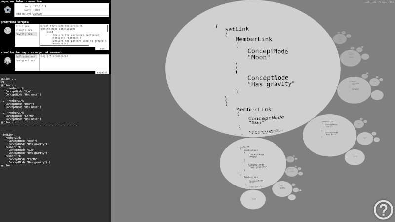

# CogProtoLab

*CogProtoLab* is a telnet interface to CogServer with automatic visualization of the current AtomSpace contents.

## about the application

OpenCog comes with command line tools for exchanging data with AtomSpace. *CogProtoLab* is built on top of this tool chain by teaming up a command prompt with a novel AtomSpace visualizer. *CogProtoLab* command prompt part should behave like OpenCog Scheme shell while visualizer part graphically displays AtomSpace contents in an interactive, fractally structured system of ovals navigable by mouse.

## why cogprotolab?

Newcomers to OpenCog may face a dificulty of working with command line which are most of OpenCog tools based on. And like command line isn't intimidating enough, the essence of symbolic artificial intelligence is by itself such a complex matter that its complexity may cause additional confusion. In a hope of easing comprehension of OpenCog symbolic segment to newbies, *CogProtoLab* tries to visually represent OpenCog AtomSpace internal states, so it is immediately visible how specific commands affect AtomSpace contents. Different (hyper)graph-rewriting strategies may then be visually traced in a process of communicating to CogServer while learning about OpenCog internals. Following a minimalistic design philosophy, *CogProtoLab* user interface tries to appear as simple as it can, shifting user focus from learning how to interact with *CogProtoLab* to learning the real design of OpenCog AtomSpace.

## short instructions

The application is consisted of two panes. Left pane resembles input command prompt for communicating to CogServer. Multiline input is obtained by holding `shift` while hitting `enter`. Standard pasting from clipboard should also work fine. History of previously entered commands is accessed by pressing up and down arrows. On hitting `enter` on its own, previously entered command is sent to CogServer. Output of the command is then brought back and displayed in the prompt interface. At the same time, right pane visualizer is updated to reflect the current AtomSpace query expression. To refresh the possibly changed contents, hit `enter` on empty command. Please refer to built in application instructions for info about navigating visualizer (the bottom-right questionmark).

## how it works

*CogProtoLab* left pane command prompt uses a php telnet connection for exchanging information with CogServer. Upon sending each prompt input, while its output is being captured and displayed, a hidden telnet query command from `visualisation captures output of command` input field is being sent to CogServer. Its output is then captured by *CogProtoLab* and visually displayed in the right pane.

### installing

Prerequisites:
- CogServer
- Appache web server
- PHP 7.4.3

After installing prerequisites, clone this package to a folder of your choice anywhere under the local web server home folder.

### running

As a first step, run `cogserver` from the OS command prompt, then open included `index.html` in a web browser over local web server, possibly adjust telnet connection defaults along with visualisation command, and you are ready to start OpenCogging in *CogProtoLab* shell. For adjusting parameters like predefined telnet parameters and commands, font size, colors, shadows, ..., edit files `init-ctrl.js` for the left application pane, and `init-fract.js` for the right application pane. Init files are representing JSON objects, and should be self-descriptive on their own.

### test drive

After opening *CogProtoLab* in web browser, one can perform a simple test to track changing contents of AtomSpace. Copy and paste the following code to *CogProtoLab* command prompt in four steps:

1. 
    ;Boilerplate code for loading the opencog modules
    (use-modules (ice-9 readline)) 
    (activate-readline)
    (add-to-load-path ".")
    (use-modules (opencog))
    (use-modules (opencog exec))

2. 
    ;Some relationships
    (Inheritance (Concept "fish") (Concept "Animal"))
    (Inheritance (Concept "dog") (Concept "Animal"))
    (Inheritance (Concept "cat") (Concept "Animal"))

3. 
    ;Graph rewriting declarations
    (define make-pets
        (Bind
            ;Declare the variables [optional]
            (Variable "$denizen")
            ;Declare the pattern used to ground the variables
            (Inheritance
                (Variable "$denizen")
                (Concept "Animal"))
            
            ;If a match is found for the pattern then we want
            ;to add the following hypergraph at the Atomspace
            (Inheritance
                (Variable "$denizen")
                (Concept "Pet"))))

4. 
    ;Trigger graph rewriting
    (cog-execute! make-pets)

Entering the above commands to *CogProtoLab* command prompt should give a basic insight in tracing incremental AtomSpace inhabitation. For more advanced examples, please refer to OpenCog documentation.

## licensing information

This package, as the most OpenCog packages, is licensed under [agplv3 License](LICENSE).

