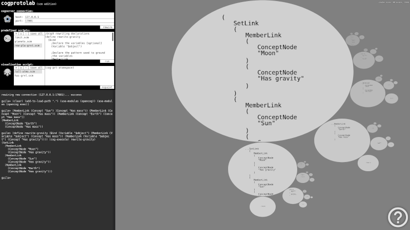

# CogProtoLab

*CogProtoLab* is in-browser AtomSpace visualizer and a telnet scripting interface to CogServer.

## about the application

OpenCog comes with command line tools for exchanging data with AtomSpace. *CogProtoLab* is built as a helper for this tool chain by teaming up AtomSpace command prompt with a novel AtomSpace visualizer.

## why cogprotolab?

Newcomers to OpenCog may face a dificulty of working with command line which are most of OpenCog tools based on. And like command line isn't intimidating enough, the essence of symbolic artificial intelligence is by itself such a complex matter that its complexity may cause additional confusion. In a hope of easing comprehension of OpenCog symbolic segment to newbies, *CogProtoLab* tries to visually represent OpenCog AtomSpace internal states, so it is immediately visible how specific commands affect AtomSpace contents. Different hypergraph-rewriting strategies may then be visually traced in a process of communicating to CogServer while learning about OpenCog internals. Following a minimalistic design philosophy, *CogProtoLab* user interface tries to appear as simple as it can, shifting user focus from learning how to interact with *CogProtoLab* to learning the real design of OpenCog AtomSpace.

## short instructions

The application is consisted of two panes. Left pane contains CogServer telnet configuration parameters, and some utility controls to corroborate input command prompt and right side visualization pane.

The utility controls are in fact little code snippet managers for editing predefined scripts and visualization scripts. There are buttons for creating, renaming, deleting, and saving such scripts to access them in the future browser sessions.

Input command prompt tries to simulate standard REPL scheme interface to CogServer. Multiline input is obtained by holding `shift` while hitting `enter`. Standard pasting from clipboard should also work fine. History of previously entered commands is accessed by pressing up and down arrows. Each entered command is sent to CogServer by hitting `enter` on its own. Output of the command is then brought back and displayed in the prompt interface. At the same time, right pane visualizer is updated to reflect the current visualization query to AtomSpace.

Please refer to built in application instructions for info about navigating the visualizer (the bottom-right questionmark).

## how does it work

*CogProtoLab* left pane command prompt internally uses a php telnet connection for exchanging information with CogServer. Upon sending each prompt input, while its output is being captured and displayed as text, a hidden telnet query command from the current contents of `visualization script` text area is being sent to CogServer. Its output is then captured by *CogProtoLab* and visually displayed in the right pane.

### installing

Prerequisites:
- CogServer
- Appache HTTP Server
- PHP 7.4.3

After installing prerequisites, there is no build procedure, just clone this package to a folder of your choice anywhere under the HTTP server home folder. It is possible to have multiple instances of *CogProtoLab* in multiple folders simultaneously.

To be able to save predefined and visualization scripts, it is required to provide read/write access privileges to `scripts` folder recursively. It is enough to do this only once, upon installing. That way we will be able to memorize all the changed script snippets by clicking on `save all` button, for use in future browser sessions. If the file privileges are not correctly adjusted, an error should be raised in a new popup window upon unsuccessful scripts saving.

To adjust some parameters like predefined telnet configuration, font sizes, colors, shadows, ..., edit files `ctrl.conf.js` for the left application pane, and `fract.conf.js` for the right application pane. These configuration files are allocating relevant JSON objects, and should be self-descriptive on their own.

### running

First, we have to run `cogserver` from the OS command prompt where a HTTP server resides, then to open `index.html` from the package root in a web browser over the HTTP server, possibly to adjust CogServer telnet connection parameters, and we are ready to start interacting with AtomSpace in *CogProtoLab*.

### test drive

After opening *CogProtoLab* application in web browser, one can perform a simple test to track changing contents of AtomSpace. Copy and paste the following code to *CogProtoLab* command prompt in four steps:

1.

    ;Boilerplate code for loading the opencog modules
    (use-modules (ice-9 readline))
    (activate-readline)
    (add-to-load-path ".")
    (use-modules (opencog))
    (use-modules (opencog exec))

2.

    ;Some relationships
    (MemberLink (Concept "Sun") (Concept "Has mass"))
    (MemberLink (Concept "Moon") (Concept "Has mass"))
    (MemberLink (Concept "Earth") (Concept "Has mass"))

3.

    ;Graph rewriting declarations
    (define make-conclusions
        (Bind
            ;Declare the variables [optional]
            (Variable "$object")
            ;Declare the pattern used to ground the variables
            (MemberLink
                (Variable "$object")
                (Concept "Has mass"))
            
            ;If a match is found for the pattern then we want
            ;to add the following hypergraph at the Atomspace
            (MemberLink
                (Variable "$object")
                (Concept "Has gravity"))))

4.

    ;Trigger graph rewriting
    (cog-execute! make-conclusions)

Successively  entering the above commands to *CogProtoLab* command prompt should give a basic insight in tracing incremental AtomSpace inhabitation. For more examples, please refer to [AtomSpace demo examples](https://github.com/opencog/atomspace/tree/master/examples/atomspace) and [official OpenCog documentation](https://wiki.opencog.org/w/The_Open_Cognition_Project).

## known issues

- Only `scm` shell is supported for now. There are plans to extend this support to other offered shells in the future.
- The time available for long running processes depends on AJAX call default timeout.
- Output of processes is not streamed while they run, yet it is returned after processes end.

## licensing information

This package, like the most of OpenCog packages, is licensed under [AGPL-3.0 license](LICENSE).

