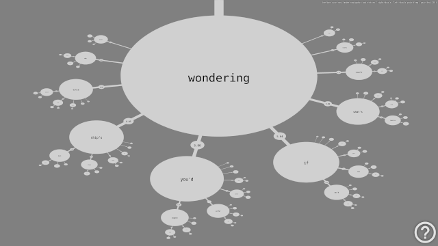

    // under construction //

# Stars

experimental opencog/learn visualization project

## Info

## Requirements

- Apache HTTP Server
- PHP
- opencog/learn database

## Use Instructions

1. Copy this directory to a local web server directory, usually under `var/www/html/`
2. `// under construction //` prepare opencog/learn database `// under construction //`
3. Configure connection host and port parameters in `fract.conf.js`
4. Load `index.html` in browser to browse the database
5. refer to built-in instructions on navigating the contents (big questionmark in bottom-right corner)

## Project Status

- To do list:
    - [ ] word-pairs
    - [ ] configurable-parameters
    - [ ] word-similarities
    - [ ] disjuncts

    // under construction //

