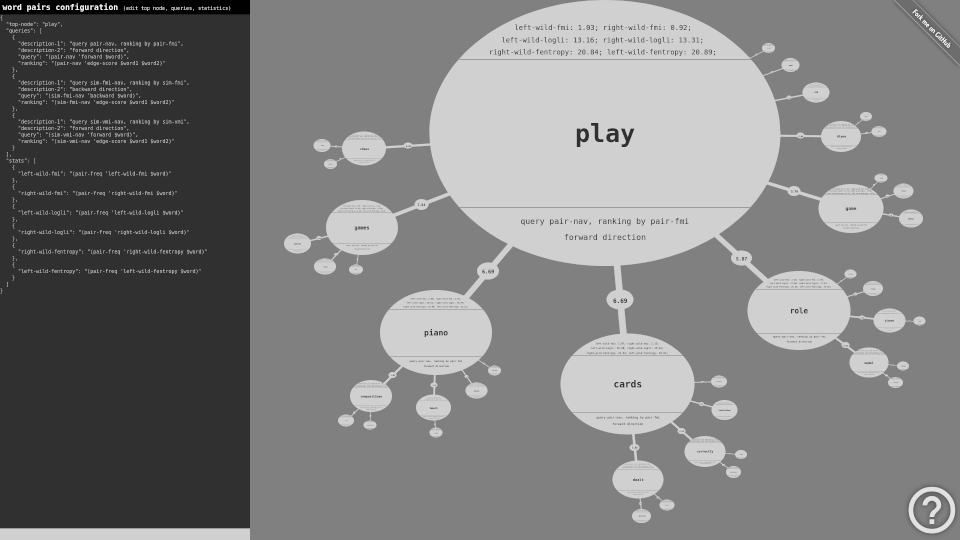

    // under construction //

# Word Pairs Visualization

experimental word pairs visualization project

## Info

## Requirements

- Apache HTTP Server
- PHP

## Use Instructions

1. Copy this directory to a local web server directory, usually under `/var/www/html/`
2. Prepare the database following instructions from directory `../run-word-pairs/`
3. Configure connection host and port parameters in `main.conf.js`
4. Load `index.html` in browser to browse the database
5. Refer to built-in instructions on navigating the contents (big questionmark in bottom-right corner) `// under construction //`

## Project Status

- To do list:
    - [x] word-pairs
    - [x] word-similarities
    - [x] right click context menu
    - [x] statistics
    - [x] configurable parameters
    - [ ] disjuncts

